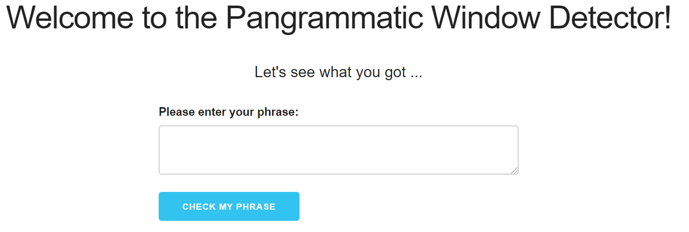
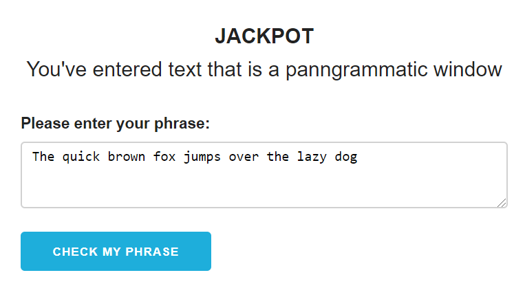

# My Pangrammatic Window Detector
Using HTML, JavaScript and CSS

This repository implements a simple application enabling users to detect a pangrammatic window. A pangrammatic window is a section of text that contains all the letters in the alphabet. 
  Example: "The quick brown fox jumps over the lazy dog"  

The following files are available:
* panWindow.html : setting the format of the webpage
* pandWindow.js : Javascript file contains the functionality of comparing the input phrase to the letters of the alphabet
* style.css: styling features

To test the application simply open the panWindow.html file in any browser.

